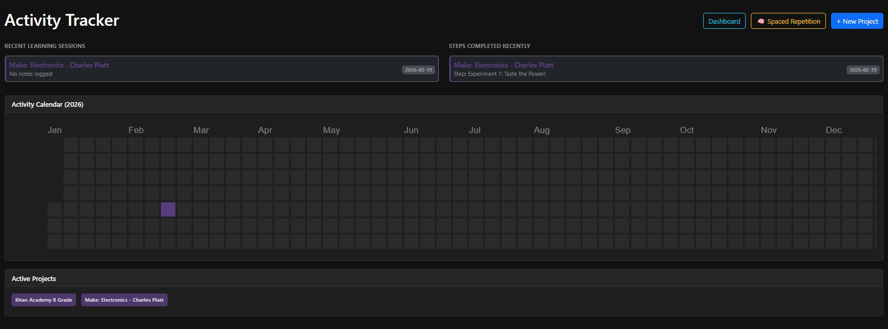

# 🧮 Synapse Flow: AI-Powered Learning & SRS Tracker

Synapse Flow is a high-performance personal activity tracker designed for lifelong learners. It combines GitHub-style activity heatmaps with a powerful Spaced Repetition System (SRS) and Google Gemini AI to transform raw study notes into long-term mastery.


<p align="center">
  
</p>


## 🚀 Key Features

-   **Activity Heatmap:** Visualizes your daily learning consistency using a D3.js calendar.
-   **AI Project Planner:** Enter a goal (e.g., "Learn Quantum Physics"), and the AI generates a sequential step-by-step roadmap.
-   **Intelligent Spaced Repetition:** Uses the SM-2 algorithm to schedule reviews for questions generated directly from your study notes.
-   **Smart Note Organization:** One-click AI formatting to turn messy session notes into structured bullet points.
-   **Multi-Source Tracking:** Link your activity to specific local PDF pages or external URLs.
-   **Dashboard Analytics:** Real-time view of recent learning sessions and project milestones.

## 🛠️ Tech Stack

-   **Backend:** Python / Flask
-   **Database:** SQLAlchemy / SQLite
-   **AI Integration:** Google GenAI (Gemini 2.0 Flash)
-   **Frontend:** Bootstrap 5, D3.js (Heatmap), MathJax (LaTeX Support)
-   **Package Manager:** [uv](https://github.com/astral-sh/uv)

## 📦 Installation

This project uses `uv` for extremely fast dependency management. If you don't have it yet, install it via [astral.sh](https://astral.sh/uv).

1. **Clone the repository:**
   ```bash
   git clone <your-repo-url>
   cd synapse-flow
   ```

2. **Create a virtual environment and install dependencies:**
   ```bash
   # uv will automatically create the venv and install everything in one go
   uv pip install -r requirements.txt
   ```

3. **Configure Environment:**
   Create a `.env` file in the root directory:
   ```env
   GEMINI_API_KEY=your_google_gemini_api_key_here
   FLASK_SECRET_KEY=something_random_and_secure
   ```

4. **Run the Application:**
   ```bash
   uv run main.py
   ```
   Visit `http://127.0.0.1:5005` in your browser.

## 📖 Usage

1. **Create a Project:** Use the "+ New Project" button and let the AI generate your steps. You can also add a **Cover Image URL** to visually identify your goals.
2. **Log Activity:** Click any day on the calendar to log what you studied. Add a URL or select a PDF from the `books/` folder.
3. **Generate Questions:** After writing notes, click "Generate Questions." AI will create flashcards with LaTeX math support.
4. **Review:** Click "Spaced Repetition" to review cards that are due today.
